# Servant, personal data hub you control

A self-hosted personal data hub that aggregates data from external services (banking, photos, health,
calendar, contacts, blockchain, etc.) via connectors and exposes it through a unified API and a web interface.

## Features

- **Universal data model**: all data stored as typed entries with JSON payloads
- **Connector plugin system**: pull data from external services on a schedule
- **Single-user**: All UIs are designed for personal usages
- **API access**: scoped, revocable tokens for scripts and agents
- **Real-time**: entry changes are pushed to connected clients over websockets
- **Self-hosted**: single binary deployment, SQLite database, runs on a Raspberry Pi

## Screenshots

<a href="docs/screenshots/dashboard.webp">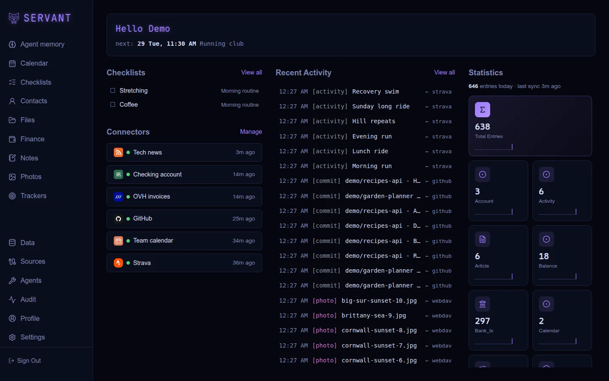</a>

<table>
  <tr>
    <td width="50%"><a href="docs/screenshots/calendar.webp">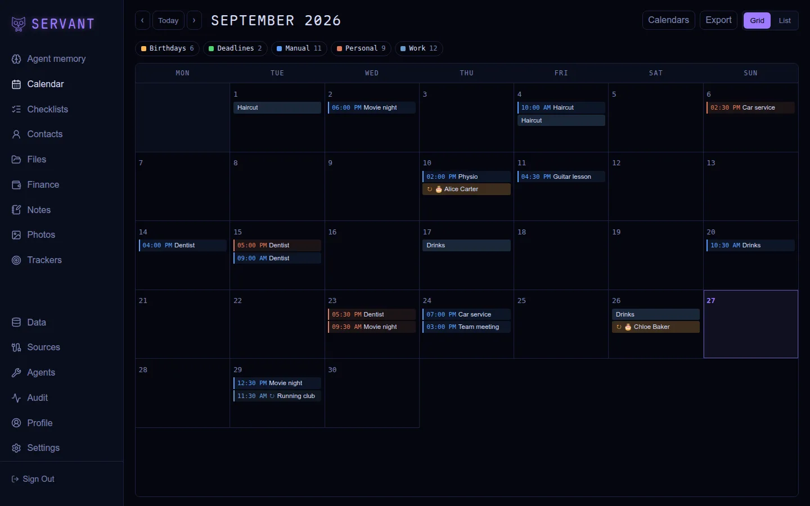</a><br><sub><b>Calendar</b>: month grid with agendas, birthdays and deadlines</sub></td>
    <td width="50%"><a href="docs/screenshots/contacts.webp">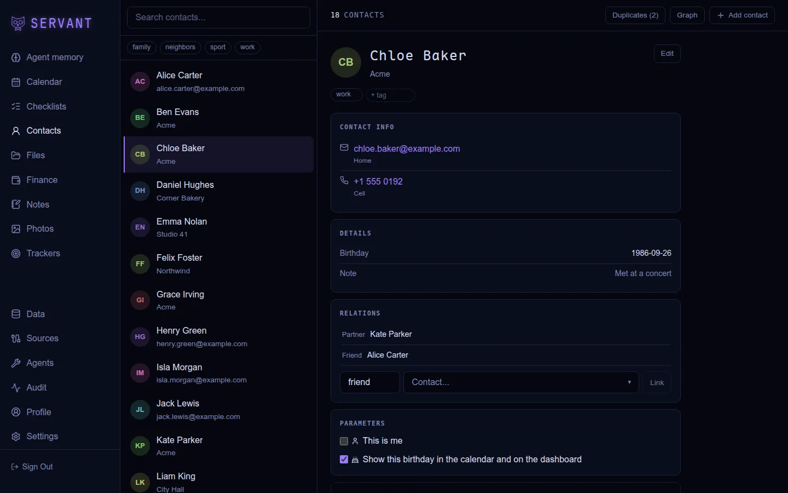</a><br><sub><b>Contacts</b>: cards with relations, events and birthdays</sub></td>
  </tr>
  <tr>
    <td width="50%"><a href="docs/screenshots/contacts-graph.webp">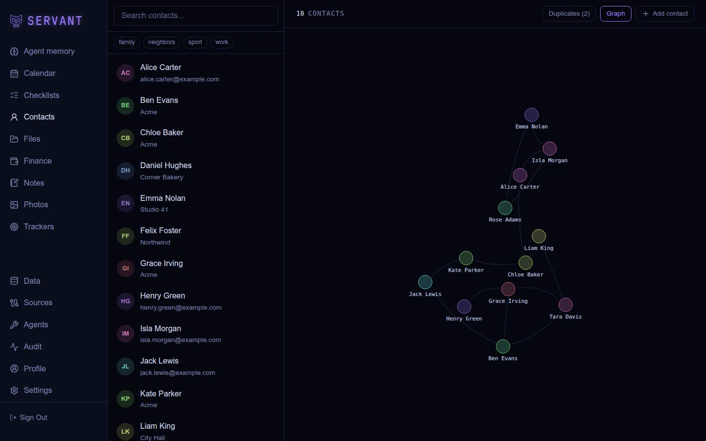</a><br><sub><b>Contacts graph</b>: the relations between people</sub></td>
    <td width="50%"><a href="docs/screenshots/notes.webp">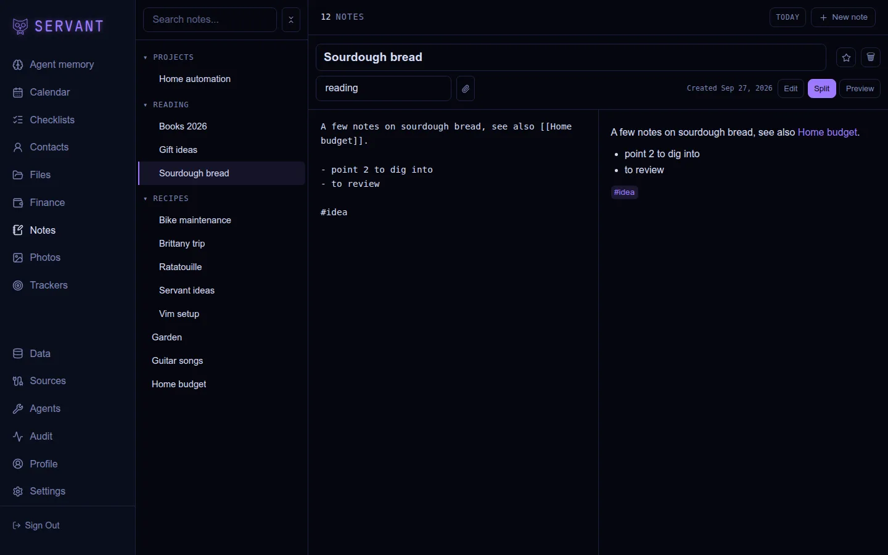</a><br><sub><b>Notes</b>: markdown with wikilinks, split edit and preview</sub></td>
  </tr>
  <tr>
    <td width="50%"><a href="docs/screenshots/photos.webp">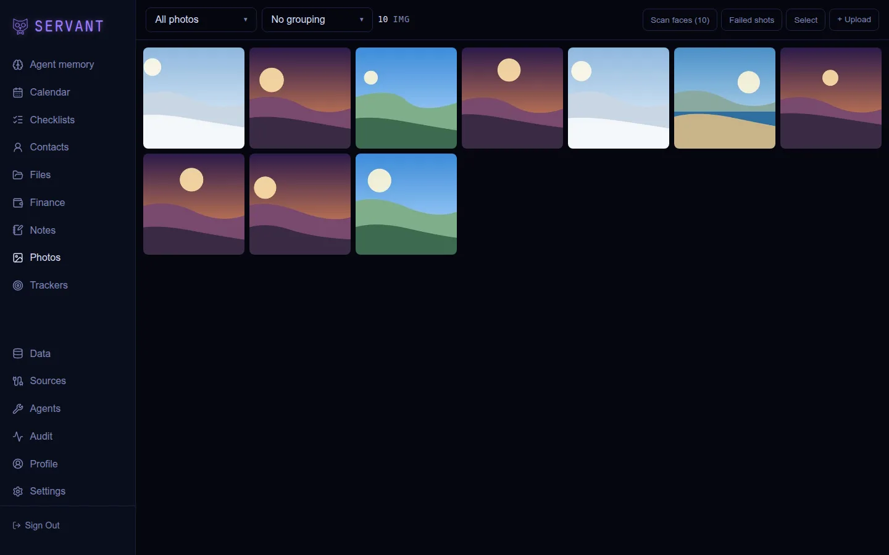</a><br><sub><b>Photos</b>: gallery, faces, share links, failed shots</sub></td>
    <td width="50%"><a href="docs/screenshots/files.webp">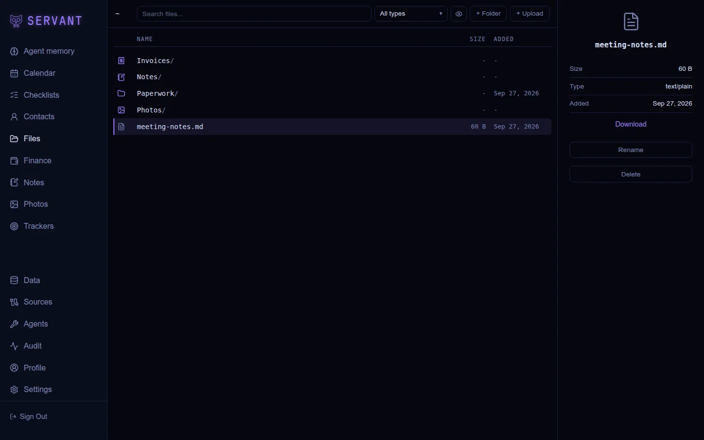</a><br><sub><b>Files</b>: storage with virtual Notes, Photos and Invoices folders</sub></td>
  </tr>
  <tr>
    <td width="50%"><a href="docs/screenshots/finance.webp">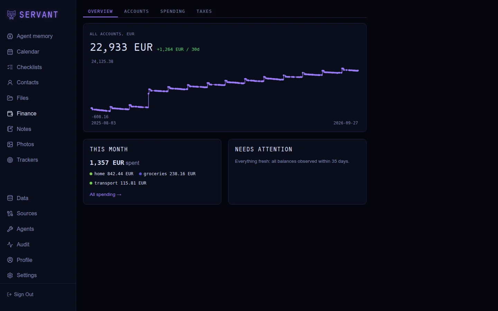</a><br><sub><b>Finance</b>: net worth, spending and taxes</sub></td>
    <td width="50%"><a href="docs/screenshots/trackers.webp">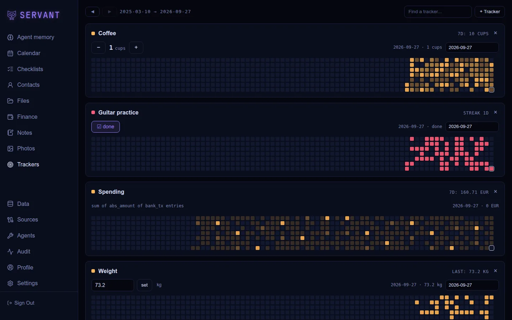</a><br><sub><b>Trackers</b>: habits and metrics as heatmaps</sub></td>
  </tr>
  <tr>
    <td width="50%"><a href="docs/screenshots/checklists.webp">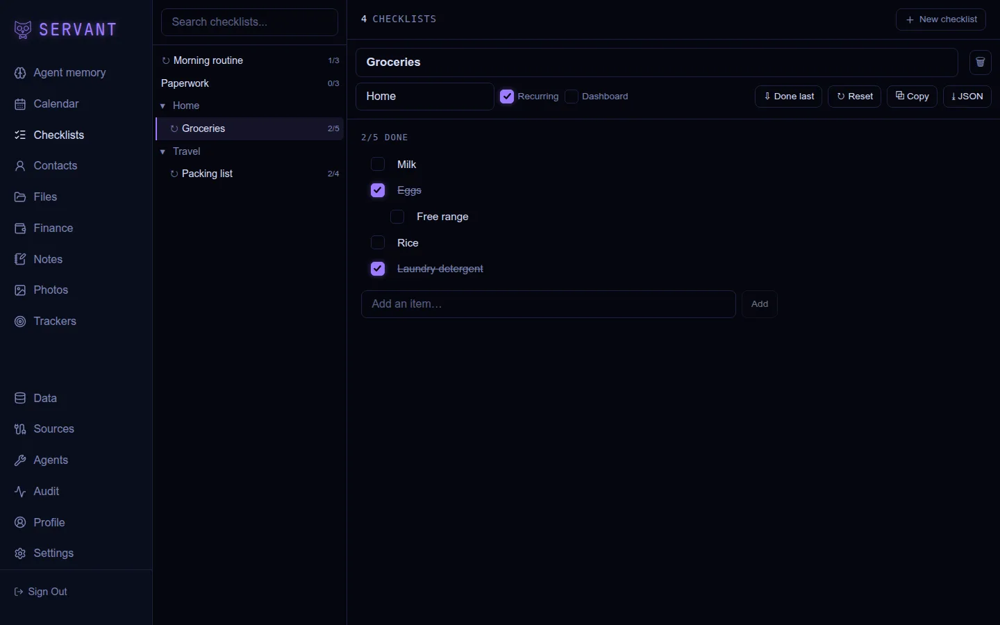</a><br><sub><b>Checklists</b>: recurring lists with nested items</sub></td>
    <td width="50%"><a href="docs/screenshots/sources.webp">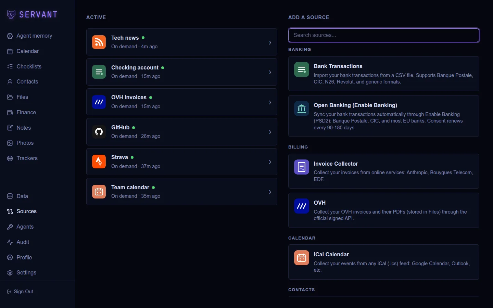</a><br><sub><b>Sources</b>: connectors syncing external services</sub></td>
  </tr>
  <tr>
    <td width="50%"><a href="docs/screenshots/agent-memory.webp">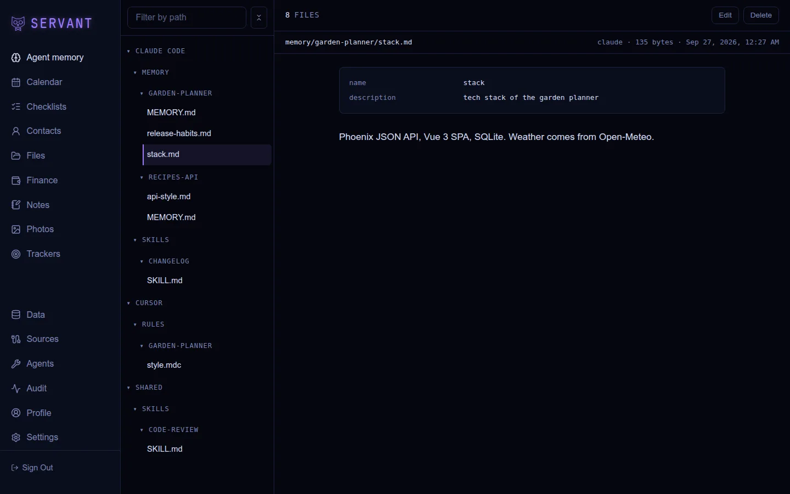</a><br><sub><b>Agent memory</b>: Claude Code and Cursor memory and skills</sub></td>
  </tr>
</table>

Captured from seeded demo data (`npm run screenshots`, see
[docs/development.md](docs/development.md#readme-screenshots)).

## Quick start

Run it with Docker (the repo ships a `Dockerfile` and a `docker-compose.yml`):

```bash
echo "SECRET_KEY_BASE=$(openssl rand -base64 48)" >> .env
echo "PHX_HOST=localhost" >> .env
docker compose up -d --build
```

Open `http://localhost:4000` and register the first account. See
[docs/deploy.md](docs/deploy.md) for bare-metal releases, environment variables, systemd, reverse proxies and backups.

## Development

```bash
mix setup                   # deps, database, migrations
cd frontend && npm install
```

```bash
mix phx.server              # API on port 4001
cd frontend && npm run dev  # frontend on port 5001
```

Open `http://localhost:5001`. See [docs/development.md](docs/development.md) for prerequisites,
project structure and architecture notes.

## Documentation

- [docs/deploy.md](docs/deploy.md): deployment (Docker, release, env vars, ops)
- [docs/backup-strategy.md](docs/backup-strategy.md): what to back up, recipes, restore procedure
- [docs/development.md](docs/development.md): dev setup, project structure, architecture
- [docs/dav.md](docs/dav.md): CalDAV/CardDAV/WebDAV endpoint (phone calendar, contacts, files)
- [docs/phone-backup.md](docs/phone-backup.md): auto-upload a phone's camera roll to the Files app
- [docs/photo-sharing.md](docs/photo-sharing.md): share a photo feed by public link from one or more tags
- [docs/custom-apps.md](docs/custom-apps.md): apps installable from git
- [AGENTS.md](AGENTS.md): coding rules and conventions
